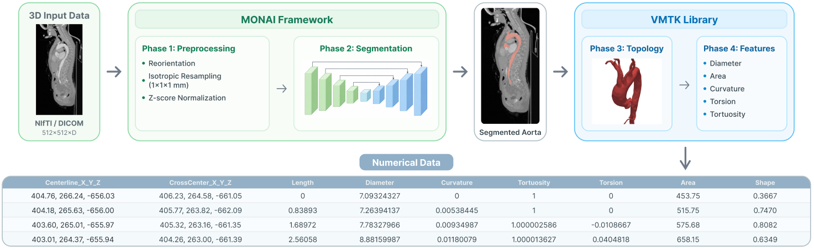
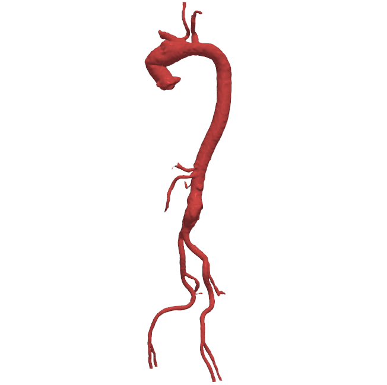
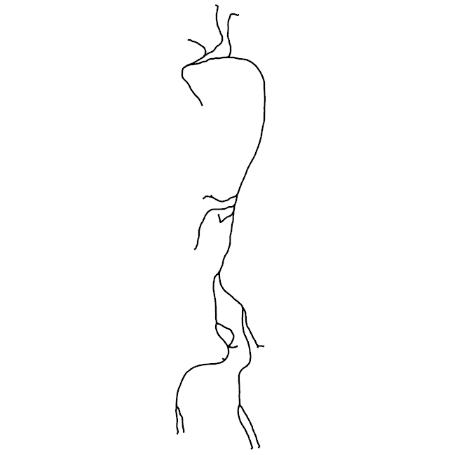
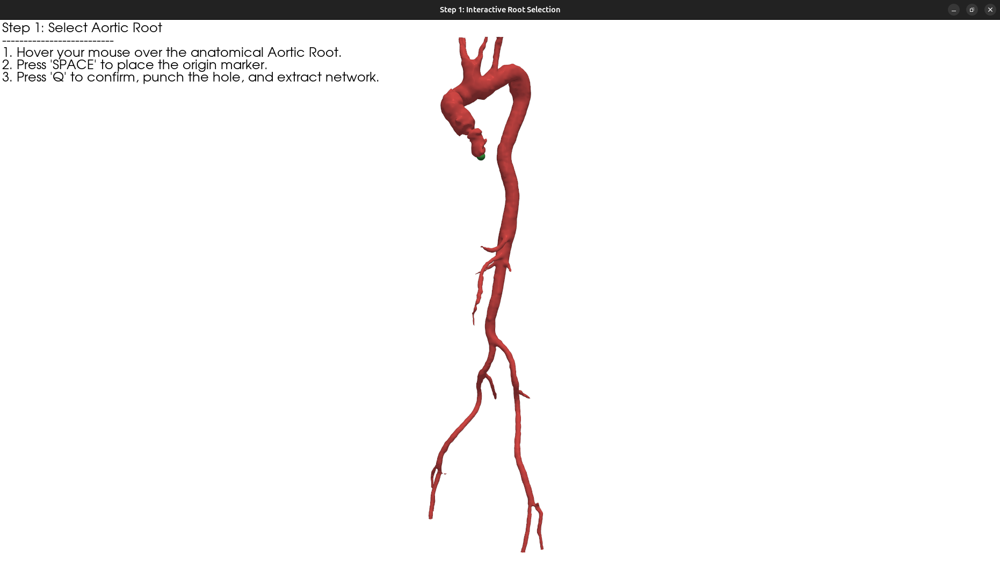

# Automated Aorta Segmentation and Feature Extraction for Medical Analysis

[](https://www.python.org/downloads/release/python-3118/)
[](https://project-monai.github.io/)
[](http://www.vmtk.org/)

> **Master's Dissertation**\
> *Author:* Ruben Filipe Nascimento Abadesso\
> *Institution:* Universidade da Beira Interior (UBI)\
> *Date:* September 2026

## Overview

This repository contains a fully automated computational framework designed to segment the Aortic Vessel Tree (AVT) and extract 28 quantitative 3D geometric biomarkers from Computed Tomography Angiography (CTA) scans. 

Cardiovascular diseases, particularly Aortic Aneurysms (AAs) and Aortic Dissections (ADs), are routinely evaluated clinically using unidimensional measurements like maximum diameter. This simplistic approach fails to fundamentally capture the complex 3D morphological changes associated with disease progression. This pipeline streamlines morphological evaluation by converting discrete radiological scans into structured tabular datasets, forming the quantitative foundation for future machine learning predictive models to assess rupture risk.

<p align="center">
  
</p>

<p align="center">
  <em>Figure 4.1: Diagram overview of the method's framework</em>
</p>

## Architecture & Methodology

The pipeline integrates state-of-the-art deep learning with robust geometric modeling, executing through four continuous phases:

1. **Data Preprocessing:** Addresses severe spatial and radiodensity heterogeneity across multicenter datasets. Steps include anatomical reorientation, isotropic resampling to 1x1x1 mm, automated foreground cropping, and Z-score intensity standardization.
2. **Volumetric Segmentation (MONAI + SegResNet):** Utilizes the highly robust **SegResNet** convolutional architecture. Operating via a sliding window inference mechanism with 50% overlap, the network accurately delineates the aorta, supra-aortic branches, and iliac arteries from surrounding tissue.
3. **Topological Processing & Centerline Extraction (VMTK):** Converts discrete voxel masks into continuous mathematical surface meshes using the Marching Cubes algorithm and volume-preserving Taubin smoothing. The central axes are computed using Voronoi diagrams.
4. **Quantitative Feature Export:** Projects the computed centerlines back onto the 3D surface to extract orthogonal clinical descriptors at regular longitudinal intervals.

<p align="center">
  
  
</p>

<p align="center">
  <em>Figure 4.13 & 4.14: Smoothed 3D surface mesh and the corresponding topological centerline network</em>
</p>

## Extracted Biomarkers

The final output is a flattened `.csv` file containing multi-dimensional arrays optimized for machine learning ingestion. Features include:
* **Cross-Sectional Metrics:** Maximum Inscribed Sphere Radius (Diameter), Cross-Sectional Area, and Shape Index (Eccentricity/Ellipticity).
* **3D Path Dynamics:** Local Curvature, Torsion, and Incremental Tortuosity Ratio.
* **Topology:** Frenet-Serret frames (Tangent, Normal, and Binormal vectors) alongside structural edge array networks.

## Project Structure

```text
.
├── Dissertacao_Mestrado_Ruben_Abadesso.pdf
├── environment.yml
├── output/
│   ├── D2_centerline_geometry.vtp
│   ├── D2.csv
│   ├── D2_smooth_surface.vtp
│   ├── R6-AAA_centerline_geometry.vtp
│   ├── R6-AAA.csv
│   └── R6-AAA_smooth_surface.vtp
├── README.md
├── script.sh
└── src/
    ├── D2.nii.gz
    ├── main_pipeline.py
    ├── R6-AAA.nii.gz
    └── SegResNet-epoch=2399-val_dice=0.9146.ckpt
```

## Installation

The pipeline requires specific versions of PyTorch, MONAI, VMTK, and PyVista. It is highly recommended to use the provided `environment.yml` to recreate the exact Conda environment.

```bash
# Clone the repository
git clone [https://github.com/rAbadesso/AASFEMA.git](https://github.com/rAbadesso/AASFEMA.git)
cd AASFEMA

# Create and activate the environment
conda env create -f environment.yml
conda activate VmtkMonai
```
*(Note: It is not necessary to activate the environment manually for execution, as running `script.sh` will activate it automatically.)*

## Usage

The primary entry point is the `script.sh` bash wrapper, which automates directory setup and triggers the Python pipeline.

```bash
# Make the script executable (only needed once)
chmod +x script.sh

# 1. Run the pipeline on a test case (Defaults to GPU 0)
./script.sh src/D2.nii.gz

# 2. Run on a specific GPU (e.g., GPU 1)
./script.sh src/R6-AAA.nii.gz 1

# 3. Run on CPU only
./script.sh src/D2.nii.gz -1
```

### Interactive Centerline Extraction
During execution, a PyVista 3D interactive window will temporarily render the smoothed surface mesh. Because supra-aortic branches extend superiorly, simple coordinate heuristics fail, requiring manual root definition:
1. Hover your mouse over the true anatomical **Aortic Root**.
2. Press **SPACE** to cast a ray and place the origin marker (green sphere).
3. Press **'Q'** to confirm and extract the network topology.

The system will automatically detect all distal endpoints (yellow spheres). 
* To remove any erroneous anatomical branches, hover over the yellow endpoint and press **'R'**.
* Press **'Q'** again to finalize the verification, compute the Voronoi centerlines, and export the dataset.

<p align="center">
  
</p>

<p align="center">
  <em>Figure 4.12: Interactive graphical interface for topological mapping and source point selection</em>
</p>

## Dataset & Training Performance

The volumetric segmentation architecture was trained and validated on a highly heterogeneous, multicenter dataset of 56 CTA scans from the MICCAI SEG.A. 2023 Challenge, which includes complex pathologies such as AAAs and ADs.

A comprehensive comparative analysis of five deep learning architectures (including 3D U-Net, DynUNet, UNETR, and SwinUNETR) definitively established the superiority of the **SegResNet** convolutional model. Benefiting from its robust contracting encoder and residual connections, SegResNet efficiently overcame the dataset's volume constraints to achieve an exceptional average **Dice Similarity Coefficient (DSC) of 0.922** and a 95th percentile Hausdorff Distance (HD95) of 36.30 mm.